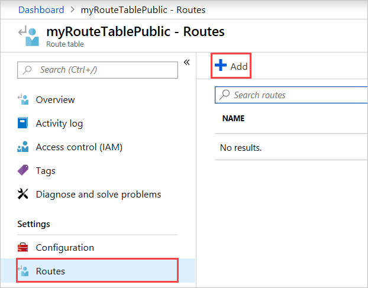
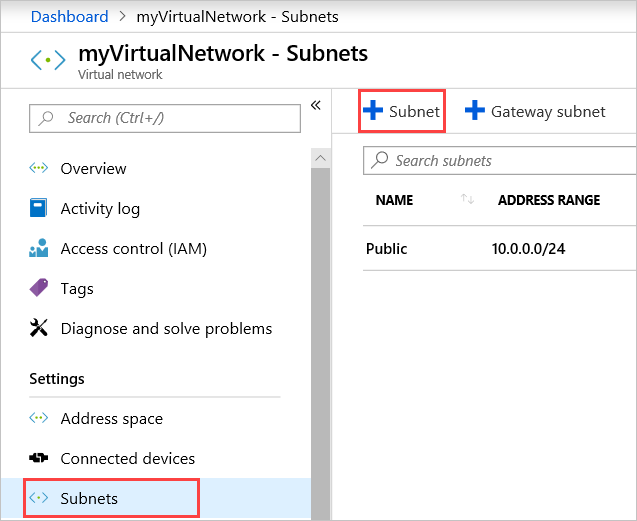
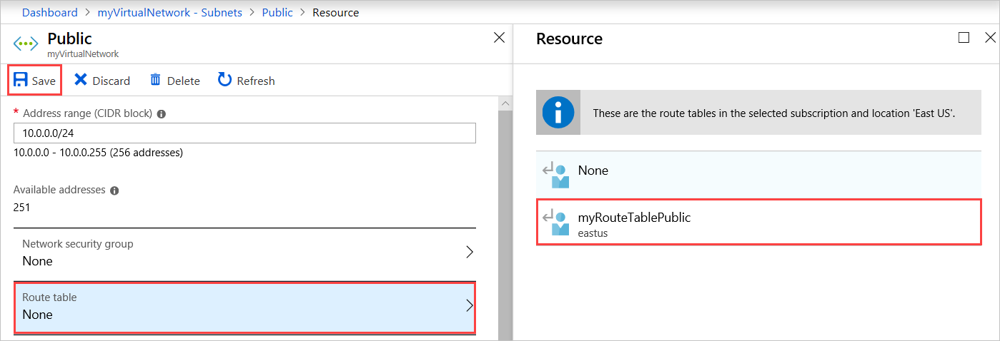
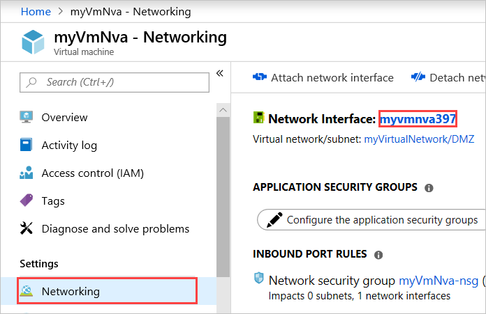
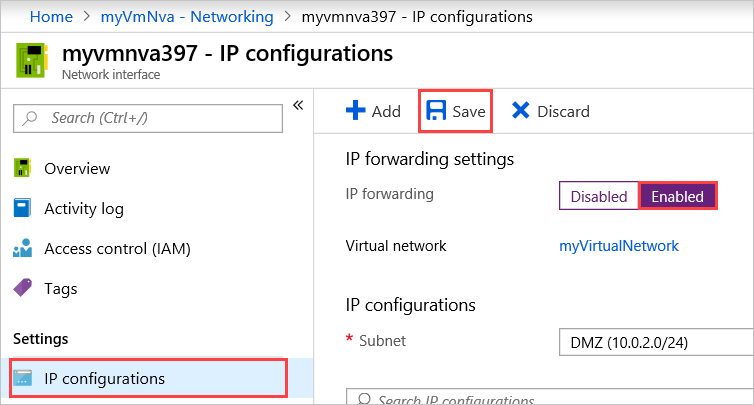

# Tutorial: Route network traffic with a route table using the Azure portal

Azure routes traffic between all subnets within a virtual network, by default. You can create your own routes to override Azure's default routing. The ability to create custom routes is helpful if, for example, you want to route traffic between subnets through a network virtual appliance (NVA). In this tutorial, you learn how to:

> [!div class="checklist"]
> * Create a route table
> * Create a route
> * Create a virtual network with multiple subnets
> * Associate a route table to a subnet
> * Create an NVA that routes traffic
> * Deploy virtual machines (VM) into different subnets
> * Route traffic from one subnet to another through an NVA

If you prefer, you can finish this tutorial using the [Azure CLI](tutorial-create-route-table-cli.md) or [Azure PowerShell](tutorial-create-route-table-powershell.md).

If you don't have an Azure subscription, create a [free account](https://azure.microsoft.com/free/?WT.mc_id=A261C142F) before you begin.

## Sign in to Azure

Sign in to the [Azure portal](https://portal.azure.com).

## Create a route table

1. On the upper-left side of the screen, select **Create a resource** > **Networking** > **Route table**.

1. In **Create route table**, enter or select this information:

    | Setting | Value |
    | ------- | ----- |
    | Name | Enter *myRouteTablePublic*. |
    | Subscription | Select your subscription. |
    | Resource group | Select **Create new**, enter *myResourceGroup*, and select *OK*. |
    | Location | Leave the default **East US**.
    | BGP route propagation | Leave the default **Enabled**. |

1. Select **Create**.

## Create a route

1. In the portal's search bar, enter *myRouteTablePublic*.

1. When **myRouteTablePublic** appears in the search results, select it.

1. In **myRouteTablePublic** under **Settings**, select **Routes** > **+ Add**.

    

1. In **Add route**, enter or select this information:

    | Setting | Value |
    | ------- | ----- |
    | Route name | Enter *ToPrivateSubnet*. |
    | Address prefix | Enter *10.0.1.0/24*. |
    | Next hop type | Select **Virtual appliance**. |
    | Next hop address | Enter *10.0.2.4*. |

1. Select **OK**.

## Associate a route table to a subnet

Before you can associate a route table to a subnet, you have to create a virtual network and subnet.

### Create a virtual network

1. On the upper-left side of the screen, select **Create a resource** > **Networking** > **Virtual network**.

1. In **Create virtual network**, enter or select this information:

    | Setting | Value |
    | ------- | ----- |
    | Name | Enter *myVirtualNetwork*. |
    | Address space | Enter *10.0.0.0/16*. |
    | Subscription | Select your subscription. |
    | Resource group | Select ***Select existing*** > **myResourceGroup**. |
    | Location | Leave the default **East US**. |
    | Subnet - Name | Enter *Public*. |
    | Subnet - Address range | Enter *10.0.0.0/24*. |

1. Leave the rest of the defaults and select **Create**.

### Add subnets to the virtual network

1. In the portal's search bar, enter *myVirtualNetwork*.

1. When **myVirtualNetwork** appears in the search results, select it.

1. In **myVirtualNetwork**, under **Settings**, select **Subnets** > **+ Subnet**.

    

1. In **Add subnet**, enter this information:

    | Setting | Value |
    | ------- | ----- |
    | Name | Enter *Private*. |
    | Address space | Enter *10.0.1.0/24*. |

1. Leave the rest of the defaults and select **OK**.

1. Select **+ Subnet** again. This time, enter this information:

    | Setting | Value |
    | ------- | ----- |
    | Name | Enter *DMZ*. |
    | Address space | Enter *10.0.2.0/24*. |

1. Like the last time, leave the rest of the defaults and select **OK**.

    Azure shows the three subnets: **Public**, **Private**, and **DMZ**.

### Associate myRouteTablePublic to your Public subnet

1. Select **Public**.

1. In **Public**, select **Route table** > **MyRouteTablePublic** > **Save**.

    

## Create an NVA

NVAs are VMs that help with network functions like routing and firewall optimization. You can select a different operating system if you want. This tutorial assumes you're using **Windows Server 2016 Datacenter**.

1. On the upper-left side of the screen, select **Create a resource** > **Compute** > **Windows Server 2016 Datacenter**.

1. In **Create a virtual machine - Basics**, enter or select this information:

    | Setting | Value |
    | ------- | ----- |
    | **PROJECT DETAILS** | |
    | Subscription | Select your subscription. |
    | Resource group | Select **myResourceGroup**. |
    | **INSTANCE DETAILS** |  |
    | Virtual machine name | Enter *myVmNva*. |
    | Region | Select **East US**. |
    | Availability options | Leave the default **No infrastructure redundancy required**. |
    | Image | Leave the default **Windows Server 2016 Datacenter**. |
    | Size | Leave the default **Standard DS1 v2**. |
    | **ADMINISTRATOR ACCOUNT** |  |
    | Username | Enter a user name of your choosing. |
    | Password | Enter a password of your choosing. The password must be at least 12 characters long and meet the [defined complexity requirements](../virtual-machines/windows/faq.md?toc=%2fazure%2fvirtual-network%2ftoc.json#what-are-the-password-requirements-when-creating-a-vm).|
    | Confirm Password | Reenter password. |
    | **INBOUND PORT RULES** |  |
    | Public inbound ports | Leave the default **None**.
    | **SAVE MONEY** |  |
    | Already have a Windows license? | Leave the default **No**. |

1. Select **Next : Disks**.

1. In **Create a virtual machine - Disks**, select the settings that are right for your needs.

1. Select **Next : Networking**.

1. In **Create a virtual machine - Networking**, select this information:

    | Setting | Value |
    | ------- | ----- |
    | Virtual network | Leave the default **myVirtualNetwork**. |
    | Subnet | Select **DMZ (10.0.2.0/24)**. |
    | Public IP | Select **None**. You don't need a public IP address. The VM won't connect over the internet.|

1. Leave the rest of the defaults and select **Next : Management**.

1. In **Create a virtual machine - Management**, for **Diagnostics storage account**, select **Create New**.

1. In **Create storage account**, enter or select this information:

    | Setting | Value |
    | ------- | ----- |
    | Name | Enter *mynvastorageaccount*. |
    | Account kind | Leave the default **Storage (general purpose v1)**. |
    | Performance | Leave the default **Standard**. |
    | Replication | Leave the default **Locally-redundant storage (LRS)**.

1. Select **OK**

1. Select **Review + create**. You're taken to the **Review + create** page and Azure validates your configuration.

1. When you see that **Validation passed**, select **Create**.

    The VM takes a few minutes to create. Don't keep going until Azure finishes creating the VM. The **Your deployment is underway** page will show you deployment details.

1. When your VM is ready, select **Go to resource**.

## Turn on IP forwarding

Turn on IP forwarding for *myVmNva*. When Azure sends network traffic to *myVmNva*, if the traffic is destined for a different IP address, IP forwarding will send the traffic to the correct location.

1. On **myVmNva**, under **Settings**, select **Networking**.

1. Select **myvmnva123**. That's the network interface Azure created for your VM. It will have a string of numbers to make it unique for you.

    

1. Under **Settings**, select **IP configurations**.

1. On **myvmnva123 - IP configurations**, for **IP forwarding**, select **Enabled** and then select **Save**.

    

## Create public and private virtual machines

Create a public VM and a private VM in the virtual network. Later, you'll use them to see that Azure routes the *Public* subnet traffic to the *Private* subnet through the NVA.

Complete steps 1-12  of [Create an NVA](#create-an-nva). Use most of the same settings. These values are the ones that have to be different:

| Setting | Value |
| ------- | ----- |
| **PUBLIC VM** | |
| BASICS |  |
| Virtual machine name | Enter *myVmPublic*. |
| NETWORKING | |
| Subnet | Select **Public (10.0.0.0/24)**. |
| Public IP address | Accept the default. |
| Public inbound ports | Select **Allow selected ports**. |
| Select inbound ports | Select **HTTP** and **RDP**. |
| MANAGEMENT | |
| Diagnostics storage account | Leave the default **mynvastorageaccount**. |
| **PRIVATE VM** | |
| BASICS |  |
| Virtual machine name | Enter *myVmPrivate*. |
| NETWORKING | |
| Subnet | Select **Private (10.0.1.0/24)**. |
| Public IP address | Accept the default. |
| Public inbound ports | Select **Allow selected ports**. |
| Select inbound ports | Select **HTTP** and **RDP**. |
| MANAGEMENT | |
| Diagnostics storage account | Leave the default **mynvastorageaccount**. |

You can create the *myVmPrivate* VM while Azure creates the *myVmPublic* VM. Don't continue with the rest of the steps until Azure finishes creating both VMs.

## Route traffic through an NVA

### Sign in to myVmPrivate over remote desktop

1. In the portal's search bar, enter *myVmPrivate*.

1. When the **myVmPrivate** VM appears in the search results, select it.

1. Select **Connect** to create a remote desktop connection to the *myVmPrivate* VM.

1. In **Connect to virtual machine**, select **Download RDP File**. Azure creates a Remote Desktop Protocol (*.rdp*) file and downloads it to your computer.

1. Open the downloaded *.rdp* file.

    1. If prompted, select **Connect**.

    1. Enter the user name and password you specified when creating the Private VM.

    1. You may need to select **More choices** > **Use a different account**, to use the Private VM credentials.

1. Select **OK**.

    You may receive a certificate warning during the sign in process.

1. Select **Yes** to connect to the VM.

### Enable ICPM through the Windows firewall

In a later step, you'll use the trace route tool to test routing. Trace route uses the Internet Control Message Protocol (ICMP), which the Windows Firewall denies by default. Enable ICMP through the Windows firewall.

1. In the Remote Desktop of *myVmPrivate*, open PowerShell.

1. Enter this command:

    ```powershell
    New-NetFirewallRule –DisplayName “Allow ICMPv4-In” –Protocol ICMPv4
    ```

    You're using trace route to test routing in this tutorial. For production environments, we don't recommend allowing ICMP through the Windows Firewall.

### Turn on IP forwarding within myVmNva

You [turned on IP forwarding](#turn-on-ip-forwarding) for the VM's network interface using Azure. The VM's operating system also has to forward network traffic. Turn on IP forwarding for *myVmNva* VM's operating system with these commands.

1. From a command prompt on the *myVmPrivate* VM, open a remote desktop to the *myVmNva* VM:

    ```cmd
    mstsc /v:myvmnva
    ```

1. From PowerShell on the *myVmNva*, enter this command to turn on IP forwarding:

    ```powershell
    Set-ItemProperty -Path HKLM:\SYSTEM\CurrentControlSet\Services\Tcpip\Parameters -Name IpEnableRouter -Value 1
    ```

1. Restart the *myVmNva* VM. From the taskbar, select **Start button** > **Power button**, **Other (Planned)** > **Continue**.

    That also disconnects the remote desktop session.

1. After the *myVmNva* VM restarts, create a remote desktop session to the *myVmPublic* VM. While still connected to the *myVmPrivate* VM, open a command prompt and run this command:

    ```cmd
    mstsc /v:myVmPublic
    ```
1. In the Remote Desktop of *myVmPublic*, open PowerShell.

1. Enable ICMP through the Windows firewall by entering this command:

    ```powershell
    New-NetFirewallRule –DisplayName “Allow ICMPv4-In” –Protocol ICMPv4
    ```

## Test the routing of network traffic

First, let's test routing of network traffic from the *myVmPublic* VM to the *myVmPrivate* VM.

1. From PowerShell on the *myVmPublic* VM, enter this command:

    ```powershell
    tracert myVmPrivate
    ```

    The response is similar to this example:

    ```powershell
    Tracing route to myVmPrivate.vpgub4nqnocezhjgurw44dnxrc.bx.internal.cloudapp.net [10.0.1.4]
    over a maximum of 30 hops:

    1    <1 ms     *        1 ms  10.0.2.4
    2     1 ms     1 ms     1 ms  10.0.1.4

    Trace complete.
    ```

    You can see the first hop is to 10.0.2.4. It's NVA's private IP address. The second hop is to the private IP address of the *myVmPrivate* VM: 10.0.1.4. Earlier, you added the route to the *myRouteTablePublic* route table and associated it to the *Public* subnet. As a result, Azure sent the traffic through the NVA and not directly to the *Private* subnet.

1. Close the remote desktop session to the *myVmPublic* VM, which leaves you still connected to the *myVmPrivate* VM.

1. From a command prompt on the *myVmPrivate* VM, enter this command:

    ```cmd
    tracert myVmPublic
    ```

    It tests the routing of network traffic from the *myVmPrivate* VM to the *myVmPublic* VM. The response is similar to this example:

    ```cmd
    Tracing route to myVmPublic.vpgub4nqnocezhjgurw44dnxrc.bx.internal.cloudapp.net [10.0.0.4]
    over a maximum of 30 hops:

    1     1 ms     1 ms     1 ms  10.0.0.4

    Trace complete.
    ```

    You can see Azure routes traffic directly from the *myVmPrivate* VM to the *myVmPublic* VM. By default, Azure routes traffic directly between subnets.

1. Close the remote desktop session to the *myVmPrivate* VM.

## Clean up resources

When no longer needed, delete the resource group and all resources it has:

1. In the portal's search bar, enter *myResourceGroup*.

1. When you see **myResourceGroup** in the search results, select it.

1. Select **Delete resource group**.

1. Enter *myResourceGroup* for **TYPE THE RESOURCE GROUP NAME:** and select **Delete**.

## Next steps

In this tutorial, you created a route table and associated it to a subnet. You created a simple NVA that routed traffic from a public subnet to a private subnet. Now that you know how to do that, you can deploy different pre-configured NVAs from the [Azure Marketplace](https://azuremarketplace.microsoft.com/marketplace/apps/category/networking). They carry out many network functions you'll find useful. To learn more about routing, see [Routing overview](virtual-networks-udr-overview.md) and [Manage a route table](manage-route-table.md).

While you can deploy many Azure resources within a virtual network, Azure can't deploy resources for some PaaS services into a virtual network. It's possible to restrict access to the resources of some Azure PaaS services. The restriction must only be traffic from a virtual network subnet though. To learn how to restrict network access to Azure PaaS resources, advance to the next tutorial.

> [!div class="nextstepaction"]
> [Restrict network access to PaaS resources](tutorial-restrict-network-access-to-resources.md)
